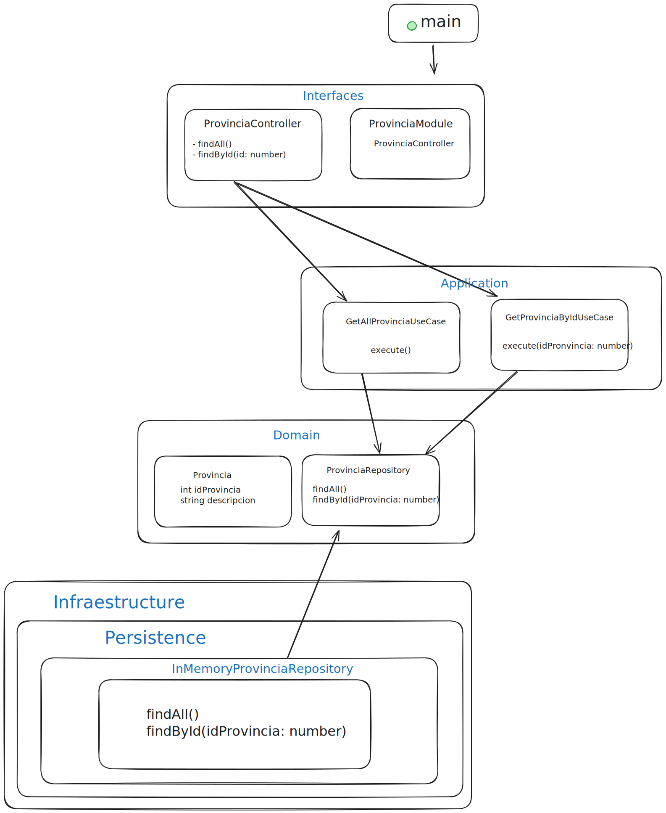

# 🌎 [API Geo CR](https://api-geo-cr.vercel.app/)

## 📖 Description

API Geo CR is a REST API that provides up-to-date geographic information about Costa Rica, including its provinces, cantons and districts. Developed with hexagonal architecture (ports and adapters) to ensure a clean and maintainable design.

## 🌐 Live Demo
You can explore the API in action here:
https://api-geo-cr.vercel.app/

## ✨ Features

- ✨ Query of all provinces of Costa Rica
- 🏙️ Detailed information of cantons by province
- 📍 Complete data of districts by canton
- 🔍 Search by ID for provinces, cantons and districts
- 📄 Integrated pagination in all queries
- 📚 Complete documentation with Swagger
- ⚡ Quick answers with data in memory
- 🧪 Complete test coverage

## 🛠️ Stack

- [NestJS](https://nestjs.com/) - Node.js Framework
- [TypeScript](https://www.typescriptlang.org/) - Programming language
- [Jest](https://jestjs.io/) - Framework de pruebas
- [Swagger/OpenAPI](https://swagger.io/) - Documentación de API

You will need:
- [Node.js 20+ (recommended 22 LTS)](https://nodejs.org/en/).
- [Git](https://git-scm.com/).

## ⚙️ Installation

```bash
# Clone the repository
git clone https://github.com/anibalalpizar/api-geo-cr.git

# Install dependencies
npm install

# Configure environment variables
cp .env.example .env
```

| Variable | Description | Possible Values | Default |
|----------|-------------|------------------|-------------|
| NODE_ENV | Execution environment | development, production, test | development |
| PORT | Application port | Any valid port | 3000 |
| SWAGGER_ENABLED | Enable/disable Swagger | true, false | true |

## 🚀 Execution

```bash
# Development mode
npm run start:dev

# Debug mode
npm run start:debug

# Production mode
npm run start:prod
```

## 🌐 API use

### Main Endpoints

```bash
# Get all provinces
GET /provincias

# Obtaining cantons from a province
GET /provincias/{id}/cantones

# Get all cantons
GET /cantones

# Obtain districts from a canton
GET /cantones/{id}/distritos

# Get all districts
GET /distritos
```

### 📋 Pagination

All endpoints support pagination via query params:

```bash
GET /provincias?page=1&limit=2
```

### 🛠️ Example Response

```json
{
  "status": "success",
  "message": "Provincias fetched successfully",
  "data": [
    {
      "idProvincia": 1,
      "descripcion": "San José"
    },
    {
      "idProvincia": 2,
      "descripcion": "Alajuela"
    }
  ],
  "meta": {
    "totalItems": 7,
    "itemCount": 2,
    "itemsPerPage": 2,
    "totalPages": 4,
    "currentPage": 1,
    "timestamp": "2024-11-22T23:03:01.448Z"
  }
}
```

### 📚 Documentation

Full API documentation is available in Swagger UI:
- Desarrollo: http://localhost:3000
- Producción: [API Documentation](https://api-geo-cr.vercel.app/)

## 🏗️ Project Structure

```
src/
├── application/       # Use cases
├── domain/            # Entities and repositories
│   ├── entities/
│   └── repositories/
├── infrastructure/    # Concrete implementations
│   └── persistence/
└── interfaces/        # Controllers and modules
```

<div align="center">
  
</div>

## 🧪 Testing

```bash
# Running unit tests
npm run test

# Running tests with coverage
npm run test:cov
```

## 🤝 Contribution

Contributions are welcome. Please follow these steps:

1. Fork the repository
2. Create a branch for your feature (`git checkout -b feature/AmazingFeature`)
3. Commit your changes (`git commit -m 'add some amazing feature'`)
4. Push to the branch (`git push origin feature/AmazingFeature`)
5. Open a Pull Request


## 🔑 License

This project is licensed under the MIT License - see the [LICENSE](LICENSE) file for details.
